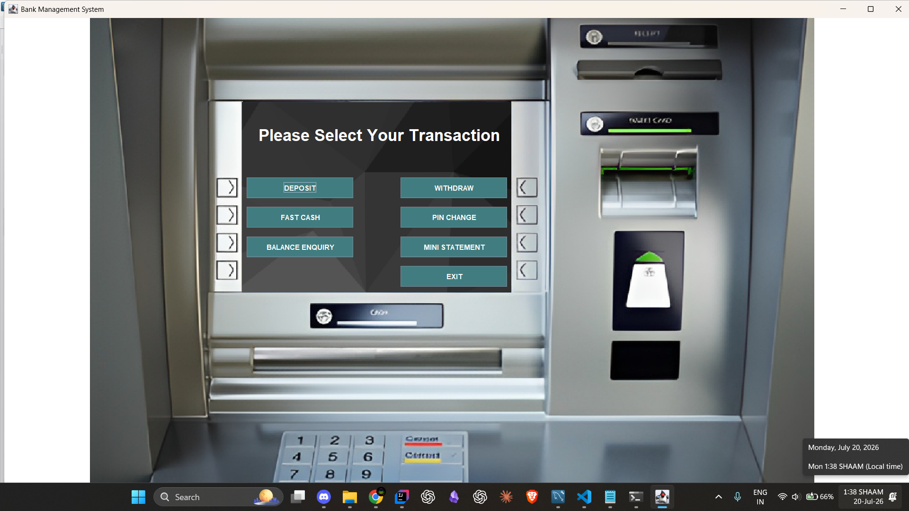

# 🏦 Bank ATM Simulator

A **console-based Banking ATM Simulator** built using **Core Java** and **MySQL** that simulates real-world ATM operations. The application provides secure user authentication, account management, and transaction processing while demonstrating Object-Oriented Programming principles and JDBC-based database connectivity.

---

## 🎥 Project Demo

> 📹 **Demo Video:**

**[](https://www.youtube.com/watch?v=lDNp3Bp4rAM)**

**[](https://www.youtube.com/watch?v=YK6tJ3nF8W8)**

---

## 🚀 Features

- 🔐 Secure account authentication using Account Number and PIN
- 💰 Check account balance
- 💵 Deposit money
- 💸 Withdraw money
- 🗃️ Persistent data storage using MySQL
- ⚠️ Input validation and exception handling
- 🏗️ Modular Object-Oriented design
- 🔄 Real-time database updates using JDBC

---

## 🛠️ Tech Stack

| Technology | Usage |
|------------|-------|
| Java | Core application development |
| JDBC | Database connectivity |
| MySQL | Data storage |
| SQL | Database operations |
| OOP | Application architecture |
| Git | Version control |
| IntelliJ IDEA / Eclipse | Development IDE |

---

## 📂 Project Structure

```
ATM-Simulator/
│
├── src/
│   ├── Main.java
│   ├── ATM.java
│   ├── Account.java
│   └── DatabaseConnector.java
│
├── sql/
│   └── atm_schema.sql
│
├── README.md
```

---

## 🗄️ Database Schema

```sql
CREATE DATABASE atm_simulator;

USE atm_simulator;

CREATE TABLE accounts (
    account_number INT PRIMARY KEY,
    pin INT NOT NULL,
    balance DECIMAL(10,2) NOT NULL
);
```

---

## ⚙️ Installation & Setup

### 1️⃣ Clone the repository

```bash
git clone https://github.com/harsh-w-s/ATM-Simulator.git
cd ATM-Simulator
```

### 2️⃣ Configure MySQL

- Create the database using the provided SQL script.
- Insert sample account data.
- Update your MySQL username and password inside `DatabaseConnector.java`.

### 3️⃣ Run the application

Run `Main.java` from your IDE.

---

## 👨‍💻 Sample Test Account

| Account Number | PIN | Balance |
|---------------|-----|---------|
| 1001 | 1234 | ₹5000.00 |

---

## 💻 Sample Output

```text
=================================
        BANK ATM SYSTEM
=================================

1. Login
2. Exit

Enter Account Number:
Enter PIN:

Login Successful!

1. Balance Enquiry
2. Deposit
3. Withdraw
4. Exit
```

---

## 🧠 Concepts Demonstrated

- Object-Oriented Programming (OOP)
- Encapsulation
- JDBC (Java Database Connectivity)
- SQL CRUD Operations
- Exception Handling
- Console-based User Interaction
- Database Design
- Modular Programming

---

## 📈 Future Enhancements

- GUI using JavaFX or Swing
- Transaction History
- Money Transfer Between Accounts
- Mini Statement
- Admin Dashboard
- Password Encryption
- Account Creation Module

---

## 📸 Screenshots

### Login Screen

> *(Add screenshot here)*

---

### Main Menu

> *(Add screenshot here)*

---

### Successful Transaction

> *(Add screenshot here)*

---

## 🤝 Contributing

Contributions are welcome!

If you'd like to improve this project, feel free to fork the repository and submit a pull request.

---

## 📄 License

This project is intended for educational and portfolio purposes.

---

## 👨‍💻 Author

**Harshwardhan Solanki**

- GitHub: https://github.com/harsh-w-s
- LinkedIn: *(Add your LinkedIn URL)*

---

⭐ If you found this project useful, consider giving it a **Star**!
